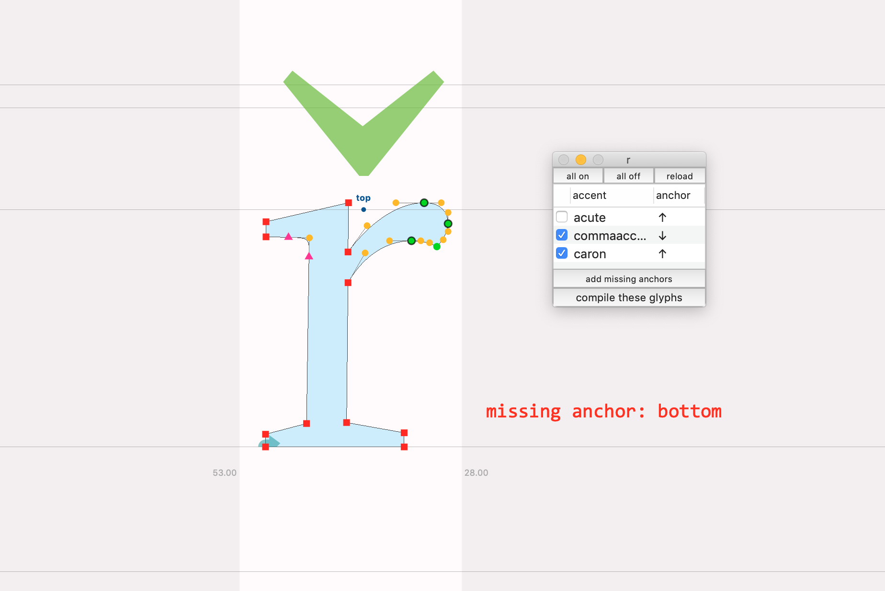

# Diacritics Workflow
A toolkit for working on diacritics/accents in RoboFont

Thom Janssen 072020


`glyphConstructions` are the basis for these tools. There is only one source so is no double data and/or out of sync things.

```
Agrave = A+grave@top
Aacute = A+acute@top
Acircumflex = A+circumflex@top
Atilde = A+tilde@top
Adieresis = A+dieresis@top
Aring = A+ring@ring
Ccedilla = C+cedilla@bottom
Egrave = E+grave@top
…
```

The glyphConstruction are stored in the font.lib. The font is in charge of what diacritics are important for the project.

### glyphConstructionEditor


Edit the database.

TODO:
  - make it a checkbox list

---

### positioning observer


In a dialog all the accent-anchor combinations are visible for this base glyph. Positioning the anchors should be easier this way. Double click on the accent-name in the list loads that accent glyph in the current glyph window. This tools works in both ways: baseGlyph>accents and accents>baseGlyphs:

If an anchor is missing, there is a warning:


---

###  batch generate

A script reads the glyphConstructions and generates all the glyphs.

---

### helpers

#### FontBoundingBox


The FontBoundingBox is an other observer that keeps track of the -yes- font bounding box. A little dialog tells you which glyphs are (among others) responsable for these extremes. And it draws the box itself.
